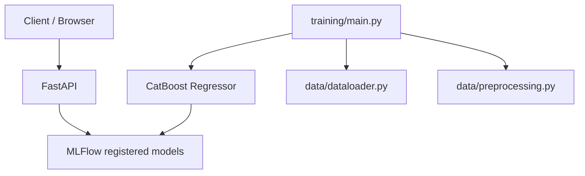

# SMG_Assignment

This is the practical assignment for the Swiss Marketplace Group. The overall task is to demonstrate the stack using class Madrid Housing Market dataset from Kaggle.

# Installation

1. Clone the repoository to your machine.
2. Locate to the project directory.
3. Make sure `python 3.11` is installed, 3.11.9 recommended.
4. Make sure `pip 24` is installed .
5. Run `python -m venv venv` to create virtual environment.
6. Activate venv via:
    - **Unix system** - `source .venv/bin/activate`
    - **Windows system** - `./venv/Scripts/Activate.ps1`
7. Run `pip install -e .` to install required dependencies. On a `Windows` machine use `pip install -e .[windows]`

# Runtime
1. Create your settings.json in `./task1/model_settings/` or use one of the presets present there.
2. Train a model. There're 2(4) ways to do it. 
    - Use these comands to run with default parameters:
        - **Unix system** - run `python task1/training/main.py`
        - **Windows system** - run `python task1\training\main.py`
    - Use these commands to run with custom parameters:
        - **Unix system** - run `python task1/training/main.py --settings_json_path *settings_filename*.json`
        - **Windows system** - run `python task1\training\main.py --settings_json_path *settings_filename*.json`
    - If using VSCode, locate to `./.vscode/launch.json` and run either `run_training_default` or `run_training_custom` depending on whether you want to train on default or custom parameters set.

# Monitoring and  REST API
- To monitor models and training process, run `mlflo ui` to run mlflow dashboard and locate to the local host as provided in the output. If default localhost is prompted, [follow this link](http://127.0.0.1:5000).
- to use POST terminal created with FastAPI, run `uvicorn task1.api.main:app --reload` and locate to the local host as provided in the output. If default localhost is prompted, [follow this link](http://127.0.0.1:8000/docs#).

##  REST API commands and models:
<details>
<summary>To predict single sample, use this curl (generated by FastAPI):</summary>

```bash
curl -X 'POST' \
  'http://127.0.0.1:8000/predict' \
  -H 'accept: application/json' \
  -H 'Content-Type: application/json' \
  -d '{
  "sq_mt_built_proc": 0,
  "sq_mt_built_present": 0,
  "sq_mt_useful_present": 0,
  "sq_mt_price": 0,
  "center_distance": 0,
  "bearing_sin": 0,
  "bearing_cos": 0,
  "latitude": 0,
  "longitude": 0,
  "has_balcony": 0,
  "has_ac": 0,
  "has_terrace": 0,
  "has_pool": 0,
  "is_exterior": 0,
  "is_renewal_needed": 0,
  "is_orientation_north": 0,
  "is_parking_included_in_price": 0,
  "is_orientation_stated": 0,
  "has_fitted_wardrobes": 0,
  "has_parking": 0,
  "is_orientation_west": 0,
  "has_central_heating": 0,
  "has_green_zones": 0,
  "is_accessible": 0,
  "is_new_development": 0,
  "is_orientation_east": 0,
  "is_orientation_south": 0,
  "has_lift": 0,
  "has_storage_room": 0,
  "has_garden": 0,
  "has_individual_heating": 0,
  "is_floor_under": 0,
  "energy_certificate_provided": 0,
  "energy_certificate": 0,
  "built_year": 0,
  "n_rooms": 0,
  "n_bathrooms": 0,
  "house_type_id": 0
}'
```
Expected response is:
```json
{
  "prediction": 131738.51060896378
}
```
</details>

<details>
<summary>To use batch predict, use this curl (generated by FastAPI):</summary>

```bash
curl -X 'POST' \
  'http://127.0.0.1:8000/batch_predict' \
  -H 'accept: application/json' \
  -H 'Content-Type: application/json' \
  -d '{
  "inputs": [
    {
      "sq_mt_built_proc": 0,
      "sq_mt_built_present": 0,
      "sq_mt_useful_present": 0,
      "sq_mt_price": 0,
      "center_distance": 0,
      "bearing_sin": 0,
      "bearing_cos": 0,
      "latitude": 0,
      "longitude": 0,
      "has_balcony": 0,
      "has_ac": 0,
      "has_terrace": 0,
      "has_pool": 0,
      "is_exterior": 0,
      "is_renewal_needed": 0,
      "is_orientation_north": 0,
      "is_parking_included_in_price": 0,
      "is_orientation_stated": 0,
      "has_fitted_wardrobes": 0,
      "has_parking": 0,
      "is_orientation_west": 0,
      "has_central_heating": 0,
      "has_green_zones": 0,
      "is_accessible": 0,
      "is_new_development": 0,
      "is_orientation_east": 0,
      "is_orientation_south": 0,
      "has_lift": 0,
      "has_storage_room": 0,
      "has_garden": 0,
      "has_individual_heating": 0,
      "is_floor_under": 0,
      "energy_certificate_provided": 0,
      "energy_certificate": 0,
      "built_year": 0,
      "n_rooms": 0,
      "n_bathrooms": 0,
      "house_type_id": 0
    }
  ]
}'
```
Expected response is:
```json
{
  "predictions": [
    131738.51060896378
  ]
}
```
</details>

<details>
<summary>openapi.json</summary>

```json
{
    "openapi": "3.1.0",
    "info": {
        "title": "CatBoost House Price Predictor API",
        "version": "0.1.0"
    },
    "paths": {
        "/health": {
            "get": {
                "summary": "Health",
                "operationId": "health_health_get",
                "responses": {
                    "200": {
                        "description": "Successful Response",
                        "content": {
                            "application/json": {
                                "schema": {}
                            }
                        }
                    }
                }
            }
        },
        "/model/info": {
            "get": {
                "summary": "Model Info Endpoint",
                "operationId": "model_info_endpoint_model_info_get",
                "responses": {
                    "200": {
                        "description": "Successful Response",
                        "content": {
                            "application/json": {
                                "schema": {}
                            }
                        }
                    }
                }
            }
        },
        "/predict": {
            "post": {
                "summary": "Predict",
                "operationId": "predict_predict_post",
                "requestBody": {
                    "content": {
                        "application/json": {
                            "schema": {
                                "$ref": "#/components/schemas/PredictionInput"
                            }
                        }
                    },
                    "required": true
                },
                "responses": {
                    "200": {
                        "description": "Successful Response",
                        "content": {
                            "application/json": {
                                "schema": {}
                            }
                        }
                    },
                    "422": {
                        "description": "Validation Error",
                        "content": {
                            "application/json": {
                                "schema": {
                                    "$ref": "#/components/schemas/HTTPValidationError"
                                }
                            }
                        }
                    }
                }
            }
        },
        "/batch_predict": {
            "post": {
                "summary": "Batch Predict",
                "operationId": "batch_predict_batch_predict_post",
                "requestBody": {
                    "content": {
                        "application/json": {
                            "schema": {
                                "$ref": "#/components/schemas/BatchPredictionInput"
                            }
                        }
                    },
                    "required": true
                },
                "responses": {
                    "200": {
                        "description": "Successful Response",
                        "content": {
                            "application/json": {
                                "schema": {}
                            }
                        }
                    },
                    "422": {
                        "description": "Validation Error",
                        "content": {
                            "application/json": {
                                "schema": {
                                    "$ref": "#/components/schemas/HTTPValidationError"
                                }
                            }
                        }
                    }
                }
            }
        }
    },
    "components": {
        "schemas": {
            "BatchPredictionInput": {
                "properties": {
                    "inputs": {
                        "items": {
                            "$ref": "#/components/schemas/PredictionInput"
                        },
                        "type": "array",
                        "title": "Inputs"
                    }
                },
                "type": "object",
                "required": [
                    "inputs"
                ],
                "title": "BatchPredictionInput",
                "description": "FastAPI input model for batch predictions.\n\nUsed to validate and parse the input data for batch predictions.\nIt contains a list of individual prediction inputs."
            },
            "HTTPValidationError": {
                "properties": {
                    "detail": {
                        "items": {
                            "$ref": "#/components/schemas/ValidationError"
                        },
                        "type": "array",
                        "title": "Detail"
                    }
                },
                "type": "object",
                "title": "HTTPValidationError"
            },
            "PredictionInput": {
                "properties": {
                    "sq_mt_built_proc": {
                        "type": "number",
                        "title": "Sq Mt Built Proc"
                    },
                    "sq_mt_built_present": {
                        "type": "number",
                        "title": "Sq Mt Built Present"
                    },
                    "sq_mt_useful_present": {
                        "type": "number",
                        "title": "Sq Mt Useful Present"
                    },
                    "sq_mt_price": {
                        "type": "number",
                        "title": "Sq Mt Price"
                    },
                    "center_distance": {
                        "type": "number",
                        "title": "Center Distance"
                    },
                    "bearing_sin": {
                        "type": "number",
                        "title": "Bearing Sin"
                    },
                    "bearing_cos": {
                        "type": "number",
                        "title": "Bearing Cos"
                    },
                    "latitude": {
                        "type": "number",
                        "title": "Latitude"
                    },
                    "longitude": {
                        "type": "number",
                        "title": "Longitude"
                    },
                    "has_balcony": {
                        "type": "number",
                        "title": "Has Balcony"
                    },
                    "has_ac": {
                        "type": "number",
                        "title": "Has Ac"
                    },
                    "has_terrace": {
                        "type": "number",
                        "title": "Has Terrace"
                    },
                    "has_pool": {
                        "type": "number",
                        "title": "Has Pool"
                    },
                    "is_exterior": {
                        "type": "number",
                        "title": "Is Exterior"
                    },
                    "is_renewal_needed": {
                        "type": "number",
                        "title": "Is Renewal Needed"
                    },
                    "is_orientation_north": {
                        "type": "number",
                        "title": "Is Orientation North"
                    },
                    "is_parking_included_in_price": {
                        "type": "number",
                        "title": "Is Parking Included In Price"
                    },
                    "is_orientation_stated": {
                        "type": "number",
                        "title": "Is Orientation Stated"
                    },
                    "has_fitted_wardrobes": {
                        "type": "number",
                        "title": "Has Fitted Wardrobes"
                    },
                    "has_parking": {
                        "type": "number",
                        "title": "Has Parking"
                    },
                    "is_orientation_west": {
                        "type": "number",
                        "title": "Is Orientation West"
                    },
                    "has_central_heating": {
                        "type": "number",
                        "title": "Has Central Heating"
                    },
                    "has_green_zones": {
                        "type": "number",
                        "title": "Has Green Zones"
                    },
                    "is_accessible": {
                        "type": "number",
                        "title": "Is Accessible"
                    },
                    "is_new_development": {
                        "type": "number",
                        "title": "Is New Development"
                    },
                    "is_orientation_east": {
                        "type": "number",
                        "title": "Is Orientation East"
                    },
                    "is_orientation_south": {
                        "type": "number",
                        "title": "Is Orientation South"
                    },
                    "has_lift": {
                        "type": "number",
                        "title": "Has Lift"
                    },
                    "has_storage_room": {
                        "type": "number",
                        "title": "Has Storage Room"
                    },
                    "has_garden": {
                        "type": "number",
                        "title": "Has Garden"
                    },
                    "has_individual_heating": {
                        "type": "number",
                        "title": "Has Individual Heating"
                    },
                    "is_floor_under": {
                        "type": "number",
                        "title": "Is Floor Under"
                    },
                    "energy_certificate_provided": {
                        "type": "number",
                        "title": "Energy Certificate Provided"
                    },
                    "energy_certificate": {
                        "type": "number",
                        "title": "Energy Certificate"
                    },
                    "built_year": {
                        "type": "number",
                        "title": "Built Year"
                    },
                    "n_rooms": {
                        "type": "number",
                        "title": "N Rooms"
                    },
                    "n_bathrooms": {
                        "type": "number",
                        "title": "N Bathrooms"
                    },
                    "house_type_id": {
                        "anyOf": [
                            {
                                "type": "number"
                            },
                            {
                                "type": "null"
                            }
                        ],
                        "title": "House Type Id"
                    }
                },
                "type": "object",
                "required": [
                    "sq_mt_built_proc",
                    "sq_mt_built_present",
                    "sq_mt_useful_present",
                    "sq_mt_price",
                    "center_distance",
                    "bearing_sin",
                    "bearing_cos",
                    "latitude",
                    "longitude",
                    "has_balcony",
                    "has_ac",
                    "has_terrace",
                    "has_pool",
                    "is_exterior",
                    "is_renewal_needed",
                    "is_orientation_north",
                    "is_parking_included_in_price",
                    "is_orientation_stated",
                    "has_fitted_wardrobes",
                    "has_parking",
                    "is_orientation_west",
                    "has_central_heating",
                    "has_green_zones",
                    "is_accessible",
                    "is_new_development",
                    "is_orientation_east",
                    "is_orientation_south",
                    "has_lift",
                    "has_storage_room",
                    "has_garden",
                    "has_individual_heating",
                    "is_floor_under",
                    "energy_certificate_provided",
                    "energy_certificate",
                    "built_year",
                    "n_rooms",
                    "n_bathrooms",
                    "house_type_id"
                ],
                "title": "PredictionInput",
                "description": "FastAPI input model.\n\nThis list of features matches the one after preprocessing\nsince some are generated there, some are restored, and some are dropped.\n\nIf lost, refer to the models' artifacts in MLflow for the exact list."
            },
            "ValidationError": {
                "properties": {
                    "loc": {
                        "items": {
                            "anyOf": [
                                {
                                    "type": "string"
                                },
                                {
                                    "type": "integer"
                                }
                            ]
                        },
                        "type": "array",
                        "title": "Location"
                    },
                    "msg": {
                        "type": "string",
                        "title": "Message"
                    },
                    "type": {
                        "type": "string",
                        "title": "Error Type"
                    }
                },
                "type": "object",
                "required": [
                    "loc",
                    "msg",
                    "type"
                ],
                "title": "ValidationError"
            }
        }
    }
}
```
</details>

# Project Diagram

